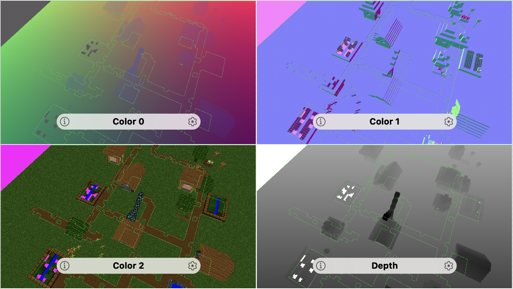
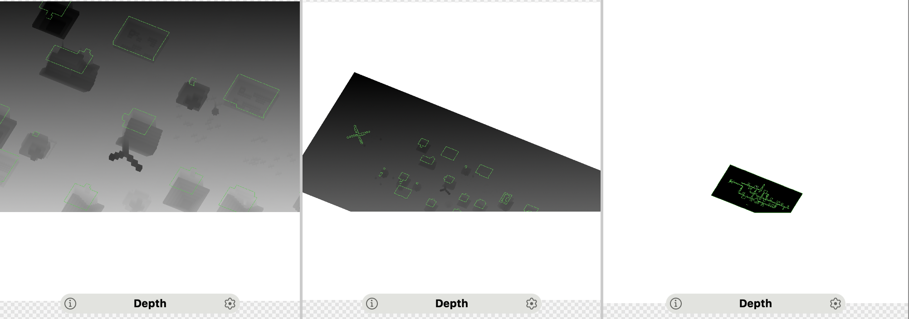

# Introduce
Named-Thread(Render Thread & Logic Thread), Trible Buffers. 

## Still In progress

A lot artifact still in project, try my best to fixing.

## Flags
  ✅ PCSS 

  ✅ Defered Rendering

  ✅ SSAO 

  ❎ SSR   

  ❎ PBR

## Snapshot
PCSS:

Defered:

CSM:

SSAO:

## Tips

- CreateSet and Bind is disastor in Vulkan, try to make a static function when your want a block data and bind later.

## Problems

- Multi VkPass is disastor in Tiled-GPU.
- Everywhere maybe optimizable.